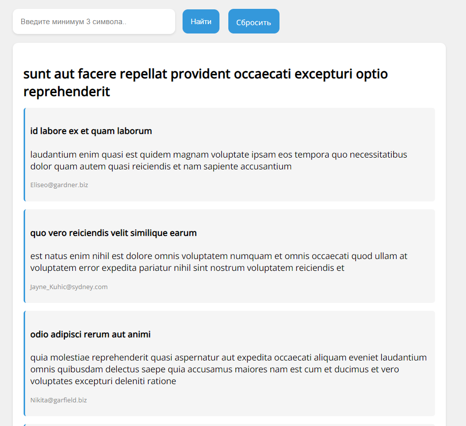

<h1 align="center">Выполнение тестового задания</h1>

    

<a name="summary">
  

    
Оглавление

    <ol>
      <li><a href="#project-description">Описание проекта</a></li>
      <li><a href="#technologies">Стек технологий</a></li>
      <li><a href="#installation">Установка и запуск приложения в локальном репозитории</a></li>
    </ol>
  

</a>

<a name="project-description"><h2>О проекте</h2></a>
Тестовое задание, в ходе которого было выполнено:
<ol>
      <li>Создать схему БД для хранения записей и комментариев к ним. SQL-запросы для создания БД поместить в отдельный файл.</li>
      <li>Создать PHP скрипт, который скачает список записей и комментариев к ним и загрузит их в БД. По завершению загрузки, вывести в консоль надпись: “Загружено Х записей и Y комментариев”</li>
      <li>Создать HTML-форму поиска записей по тексту комментария (поле ввода и кнопка “Найти”). Поиск должен работать при вводе минимум 3-х символов. В результатах поиска вывести заголовок записи и комментарий с искомой строкой.</li>
    </ol>

<a name="technologies"><h2>Стек технологий</h2></a>

	<code></code>
	<code></code>
	<code></code>

<a name="installation"><h2>Установка и запуск</h2></a>
1. Клонировать в папку на локальный сервер (я использую OpenServer)
2. Импортировать базу данных
3. Запустить локальных сервер и запустить сайт

